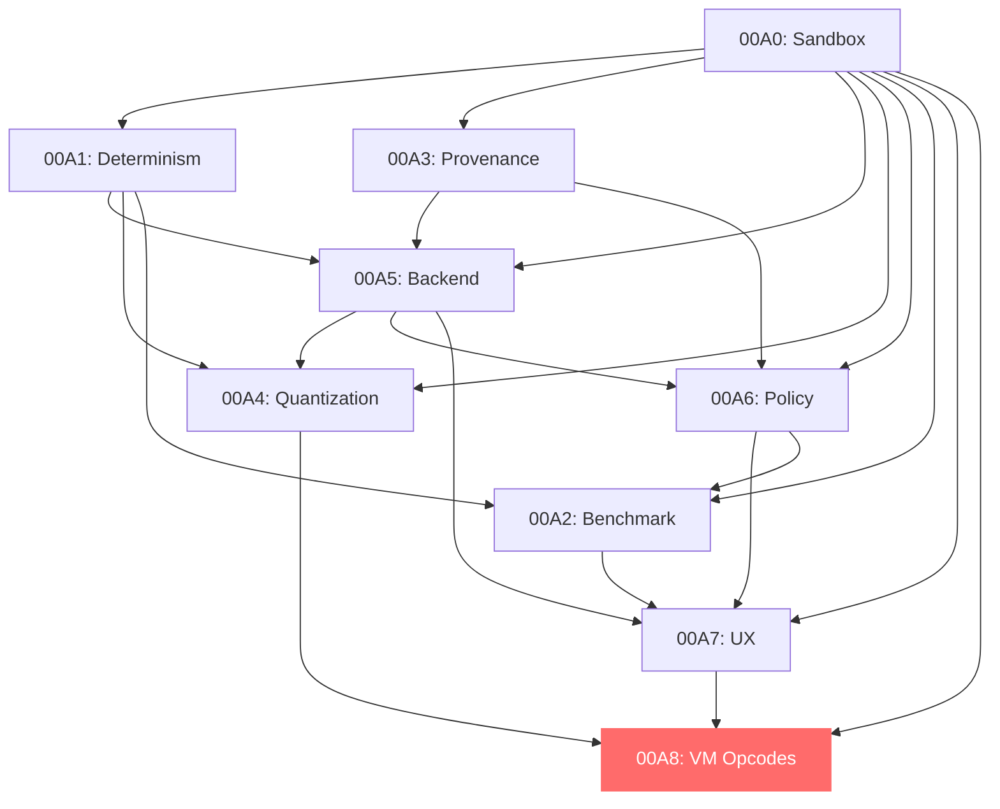

# T81 AI Integration RFC Stack Summary

## 1. Full RFC Index

| RFC ID | Title | Status | Risk Level | Experimental/Core | Dependencies |
|---------|-------|---------|------------------|-------------|
| RFC-00A0 | AI Experiment Sandbox and Repository Boundaries | Draft | Low | Experimental | None |
| RFC-00A1 | Deterministic Evidence and Reproducibility Protocol for AI Workloads | Draft | Low | Experimental | 00A0 |
| RFC-00A2 | AI Benchmark Specification and Reporting Format | Draft | Low | Experimental | 00A0, 00A1 |
| RFC-00A3 | Model Artifact Identity and Provenance (GGUF/Safetensors Policy) | Draft | Medium | Experimental | 00A0 |
| RFC-00A4 | Ternary Quantization Codec Contract (T3_K and Friends) | Draft | Medium | Experimental | 00A0, 00A1 |
| RFC-00A5 | LLM Backend Adapter Interface (Engine-Agnostic) | Draft | High | Experimental | 00A0, 00A1, 00A3 |
| RFC-00A6 | Axion Policy Hooks for Inference and Tooling Events | Draft | Low | Experimental | 00A0, 00A3, 00A5 |
| RFC-00A7 | UX Integration for AI in T81 (CLI + Observability + Workflows) | Draft | Low | Experimental | 00A0, 00A1, 00A5, 00A6 |
| RFC-00A8 | AI-Native VM Opcode Exploration (QMATMUL/ATTN/EMBED…) | Draft | High | Permanent Experimental | 00A0, 00A1, 00A4, 00A5 |

## 2. Cross-RFC Consistency Check

### ✅ Terminology Consistency
- **Determinism**: All RFCs use consistent terminology for deterministic execution
- **CanonFS**: Consistent references across RFC-00A1, 00A3, 00A4
- **Axion**: Consistent policy system references in RFC-00A3, 00A5, 00A6
- **Ternary**: Consistent quantization terminology in RFC-00A4, 00A8
- **Experimental**: Consistent sandbox references in all RFCs

### ✅ CLI Command Consistency
All RFCs use the standardized `t81 ai <command> [options]` format:
- `t81 ai model <subcommand>`
- `t81 ai inference <subcommand>`
- `t81 ai quantize <input> <output>`
- `t81 ai verify <target>`
- `t81 ai benchmark <model>`
- `t81 ai policy <subcommand>`

### ✅ Directory Structure References
Consistent experimental directory structure:
- `/experiments/ai/` - Primary sandbox
- `/extensions/ai/` - Promoted features
- `/research/ai/` - Long-term research

### ✅ Determinism Terminology
Consistent determinism concepts:
- **Strict Determinism**: Bit-exact reproducibility
- **Statistical Determinism**: Within tolerance bounds
- **Reproducible Non-Determinism**: Documented randomness

### ✅ Policy/Axion References
Consistent policy integration:
- Model loading policies (RFC-00A3, 00A6)
- Inference execution policies (RFC-00A5, 00A6)
- Tool use policies (RFC-00A6)

## 3. Dependency Graph



**Implementation Order:**
1. **Foundation Layer**: 00A0 → 00A1 → 00A3
2. **Integration Layer**: 00A5 → 00A4 → 00A6
3. **Experience Layer**: 00A2 → 00A7
4. **Optimization Layer**: 00A8 (Permanent Experimental)

## 4. Repository Impact Map

### Experimental Phase Directories
```
/experiments/ai/
├── sandbox/                    # RFC-00A0
├── determinism/               # RFC-00A1
├── benchmarks/                # RFC-00A2
├── model_provenance/          # RFC-00A3
├── quantization/              # RFC-00A4
├── llm_backend/              # RFC-00A5
├── policy_hooks/              # RFC-00A6
├── ux_tools/                 # RFC-00A7
└── vm_opcodes/               # RFC-00A8
```

### Extension Phase Directories
```
/extensions/ai/
├── quantization/              # RFC-00A4
├── inference/                # RFC-00A5
├── policy/                  # RFC-00A6
└── tooling/                 # RFC-00A7
```

### Core Integration (Post-Promotion)
```
/src/
├── ai/                      # RFC-00A5 (partial), RFC-00A8 (full)
└── vm/                       # RFC-00A8

/include/t81/
├── ai/                      # RFC-00A5 (interface), RFC-00A8 (opcodes)
└── quantization/              # RFC-00A4

/spec/
├── ai-*.md                  # All RFC specifications
└── t81-ai-spec.md          # Consolidated AI spec

/tests/
├── ai/                      # All AI feature tests
└── deterministic/            # RFC-00A1 validation
```

**✅ Core Directory Protection**: No RFC requires modifying `/src`, `/include/t81`, `/spec`, or `/tests` during experimental phase.

## 5. UX Surface Summary

### Final CLI Command Surface
```bash
# Model Management
t81 ai model list [--source trusted|experimental|all]
t81 ai model pull <model-id> [--verify-signatures]
t81 ai model inspect <model-id> [--show-provenance]

# Inference Operations
t81 ai inference run --model <model-id> --prompt "<text>" [--deterministic]
t81 ai inference benchmark --model <model-id> --prompts file.txt

# Quantization
t81 ai quantize --input <model.fp32> --output <model.t3k2> [--codec T3_K2]

# Determinism Validation
t81 ai verify --model <model-id> [--determinism] [--runs 100]

# Benchmarking
t81 ai benchmark --model <model-id> [--suite standard] [--output results.json]

# Policy Management
t81 ai policy test [--event-type <type>] [--model <model-id>]
t81 ai policy add-rule <policy-file>
t81 ai policy audit-logs [--filter <criteria>]

# Observability
t81 ai observability dashboard [--port 8080]
t81 ai observability trace --session <session-id>
t81 ai observability metrics [--export prometheus]
```

### Key UX Principles
- **Determinism First**: All commands reinforce deterministic execution
- **Audit Trail**: Every operation logged and verifiable
- **Progressive Disclosure**: Simple commands with advanced options
- **Consistent Naming**: Verb-noun pattern throughout
- **Error Clarity**: Clear error messages with remediation suggestions

## 6. Implementation Phases

### Phase 1: Foundation (Low Risk)
**Goal**: Establish safe experimentation boundaries and validation framework

**RFCs**: 00A0, 00A1, 00A3
**Duration**: 4-6 weeks
**Deliverables**:
- Experimental sandbox infrastructure
- Determinism evidence protocol
- Model provenance system
- Basic security policies

**Success Criteria**:
- All experimental builds compile and run independently
- Determinism validation working across platforms
- Model integrity verification functional

### Phase 2: Integration (Medium Risk)
**Goal**: Build core AI capabilities with deterministic guarantees

**RFCs**: 00A5, 00A4, 00A6
**Duration**: 8-12 weeks
**Deliverables**:
- LLM backend adapter system
- Ternary quantization codecs
- AI policy enforcement framework
- Cross-backend determinism

**Success Criteria**:
- Multiple inference backends supported
- Quantization quality meets targets
- Policy hooks prevent security violations
- Resource management prevents overload

### Phase 3: Experience (Low-Medium Risk)
**Goal**: Provide comprehensive developer experience

**RFCs**: 00A2, 00A7
**Duration**: 4-6 weeks
**Deliverables**:
- Standardized benchmark suite
- Complete CLI tooling
- Observability dashboard
- Workflow automation

**Success Criteria**:
- Benchmark results reproducible across platforms
- Developer productivity improved
- Real-time monitoring functional
- CI/CD integration working

### Phase 4: Optimization (High Risk - Permanent Experimental)
**Goal**: Explore VM-level AI optimizations

**RFC**: 00A8
**Duration**: Ongoing research
**Deliverables**:
- AI-native VM opcodes
- Hardware acceleration interface
- Performance benchmarks
- Formal verification proofs

**Success Criteria**:
- Performance improvements demonstrated
- Determinism maintained at VM level
- Hardware acceleration working
- Community adoption for research

## 7. Architecture Risk Summary

### Risk Mitigation Strategy
| Risk Level | RFCs | Mitigation Approach |
|-------------|--------|-------------------|
| **Low** | 00A0, 00A1, 00A2, 00A6, 00A7 | Standard development practices, comprehensive testing |
| **Medium** | 00A3, 00A4 | Security audits, quality validation, gradual rollout |
| **High** | 00A5, 00A8 | Strict protocols, formal verification, permanent experimental status |

### Determinism Preservation Guarantees
1. **Experimental Isolation**: No core modifications during experimental phase
2. **Validation Protocols**: Determinism testing required for promotion
3. **Policy Enforcement**: All AI operations subject to Axion policies
4. **Audit Trails**: Complete logging for all AI operations
5. **Rollback Capability**: Ability to disable features causing determinism issues

---

## Conclusion

The T81 AI Integration RFC Stack provides a comprehensive, safe, and deterministic path for introducing AI capabilities into the T81 ecosystem. The phased approach ensures that:

- **Core Stability**: Deterministic computing foundation remains protected
- **Incremental Innovation**: Features progress through controlled experimentation
- **Developer Experience**: AI capabilities are accessible and well-integrated
- **Security First**: All operations are auditable and policy-compliant
- **Performance Focus**: Optimization opportunities are explored safely

This architecture enables T81 to become the premier platform for **deterministic AI computing** while maintaining its core principles of bit-exact reproducibility.

---

**Document Status**: Final  
**Last Updated**: 2026-03-05  
**Next Review**: Post-implementation of Phase 1  
**Contact**: T81 Foundation Architecture Team
