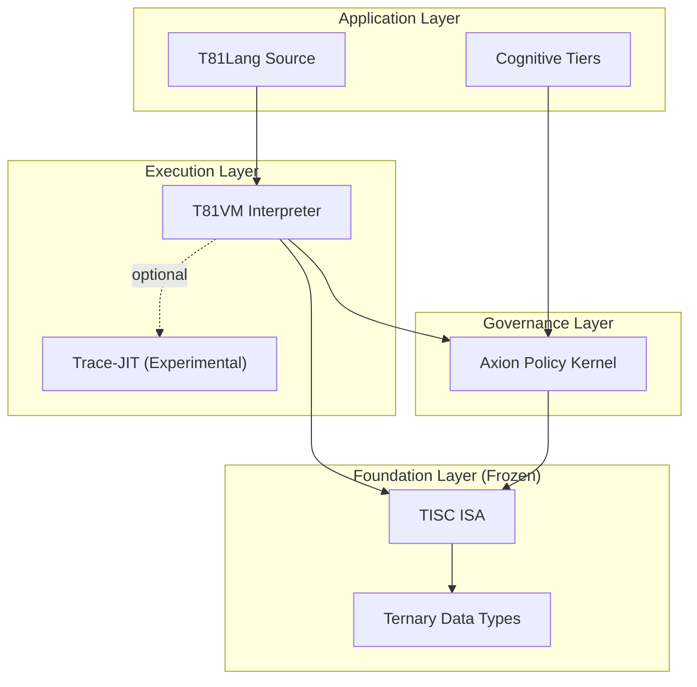

### **Executive Summary**

The `t81-foundation` repository presents the ambitious and technically rigorous **T81 project**, a complete computational stack built from the ground up on balanced ternary logic. Conceived "by AI, for AI," its primary goal is to replace the non-determinism and architectural drift of binary/IEEE 754 systems with a foundation of **bit-exact reproducibility, auditable governance, and native support for cognitive structures**. The project is well-structured, with a clear separation of concerns across its layers: the frozen Foundation (TISC ISA, Ternary Data Types), the Execution Layer (T81VM), the Governance Layer (Axion), and the Application Layer (T81Lang, Cognitive Tiers). While still in early development (evidenced by modest community metrics and alpha/beta component status), the project's design, comprehensive documentation, and innovative features like AI-native opcodes (RFC-0026) and an opcode-level policy engine position it as a unique and potentially foundational contribution to fields demanding verifiable computing, such as advanced AI safety, cryptography, and scientific computing.

### **1. Project Overview: The T81 Vision**

The repository's purpose is to define and implement **T81, a unified, deterministic, ternary-native computational architecture**. Its core promise is to provide a mathematically rigorous foundation where reproducibility, governance, and cognitive structure are guarantees at the Instruction Set Architecture (ISA) level.

**Key Features and Goals:**

*   **Base-81 Data Types:** The foundation is built on balanced ternary digits (`trit`s: -1, 0, +1), which are grouped into `tryte`s (6 trits, representing 729 values, analogous to a byte) and larger structures. This is not merely a datatype change but a fundamental shift in logic.
*   **TISC Instruction Set:** The **Ternary Instruction Set Computer (TISC)** is the "frozen" ISA, designed to be an immutable standard. It includes novel opcodes for AI workloads, as detailed in RFC-0026 (e.g., `ATTN` for attention mechanisms, `QMATMUL` for quantized matrix multiplication).
*   **T81VM:** The virtual machine that executes TISC bytecode. It features a deterministic interpreter and an experimental Trace-JIT for performance, with determinism guarantees scoped to "governed/verified surfaces."
*   **T81Lang:** A high-level language (currently in Beta) that compiles to TISC bytecode, allowing developers to write ternary-native programs.
*   **Axion Safety/Optimization Engine:** This is the **Governance Layer**, a policy kernel that intercepts execution to enforce safety rules, resource limits, and ethical guardrails defined in configuration. This makes governance an "ISA-level invariant."
*   **Recursive Cognition Tiers:** The project posits a formal model for AI reasoning, where cognitive scales are represented as explicit tiers within the architecture, providing a structure for verifiable AI governance.

### **2. Technical Architecture: A Layered, Deterministic Stack**

The architecture is elegantly layered, as visualized in the repository's flowchart, ensuring strict boundaries of authority and abstraction.



**Implementation of Ternary Computing & Advantages:**

*   **Balanced Ternary:** Implemented as the core logic `{-1, 0, +1}`. This is a significant departure from binary. Its key advantages, as argued by the project, include:
    *   **Neural-native Mapping:** Directly corresponds to biological and artificial neural states (inhibit/neutral/excite), potentially leading to more efficient and intuitive AI models.
    *   **Information Density:** A trit holds more information than a bit (\(\log_2 3 \approx 1.58\) bits of information). This can lead to more efficient representation of data.
    *   **Sign and Value:** The balanced representation inherently includes the number's sign, simplifying arithmetic logic.
*   **Determinism:** The stack tackles non-determinism head-on with "**Deterministic Soft-Float (bounded)** ," promising bit-exact behavior on explicitly verified surfaces. This is enforced by the Axion kernel and the "Repro Gate" CI checks.
*   **Quantization (2.63-bit):** The reference to "2.63-bit balanced ternary for LLMs" is a powerful concept. By quantizing 16-bit weights into balanced ternary states, the architecture could dramatically reduce model size and computational complexity for inference, a goal directly supported by the AI-native opcodes in TISC.

### **3. Code Analysis: Structure, Quality, and Notable Implementations**

*   **Code Structure & Languages:** The project is highly organized, with a clear directory structure (`core/`, `kernel/`, `vm/`, `lang/`, `docs/`, `tests/`). **C++ (90.1%)** is the primary language, chosen for its performance and systems-level control. Python (5.9%) is used for scripting, tooling, and CI checks (e.g., `scripts/ci/`).
*   **Quality Metrics:**
    *   **Modularity:** Excellent. The physical separation of components (VM, Kernel, Lang) perfectly mirrors the logical architecture, promoting maintainability and independent development.
    *   **Documentation:** Outstanding for a project of this size. It includes a multi-lingual README, a dedicated `docs/` directory, normative specifications (`spec/`), and architecture decision records implicitly via RFCs. The "Monograph" link points to a comprehensive book.
    *   **Error Handling & Testing:** The presence of a `tests/` directory and a dedicated "Repro Gate" script (`t81lang_repro_gate.py`) indicates a strong commitment to correctness and determinism. The CI/CD configurations (`.github/`, `.pre-commit-config.yaml`) show a mature development workflow. The concept of "Spec-as-Executable" (RFC-0027) is a novel testing strategy, using T81Lang programs as conformance tests for the spec itself.
*   **Notable Implementations:**
    *   **The Emulator/VM:** The `src/` and `runtime/` directories likely contain the core T81VM implementation. Its design as a deterministic interpreter is the project's linchpin.
    *   **Tools:** The `tools/` and `scripts/` directories contain essential utilities for building, running, and verifying the stack, with the `t81` binary acting as the primary interface.

**Strengths, Potential Bugs, and Optimizations:**

*   **Strengths:** The architecture's clarity, the frozen foundation layer, and the innovative governance model are its greatest strengths.
*   **Potential Bugs/Optimizations:** Without deep code execution, it's impossible to identify specific bugs. However, the complexity of the Trace-JIT and the Axion policy engine are likely areas where subtle, non-deterministic bugs could emerge. The project's own status labels ("Beta," "Alpha") correctly identify these as areas of active development. An optimization opportunity could be exploring SIMD instructions in conventional CPUs to accelerate balanced ternary operations, even in software.

### **4. Innovations and Contributions: A New Paradigm for Trustworthy Computing**

T81 is not just another programming language or VM; it is a rethinking of the computational stack's foundations.

*   **Unique Innovations:**
    1.  **Governance as an ISA Primitive:** Embedding a policy kernel (Axion) at the opcode level is a radical step toward "auditable AI governance." It allows for mathematically verifiable enforcement of safety rules, a feature completely absent in binary stacks.
    2.  **AI-Native ISA (RFC-0026):** Defining opcodes like `ATTN` and `QMATMUL` moves AI workloads from being a library concern to a hardware/ISA concern, paving the way for unprecedented efficiency and verifiability.
    3.  **Spec-as-Executable (RFC-0027):** This blurs the line between documentation and testing, ensuring the specification is always in sync with a verifiable implementation.
*   **Applications in AI, Cryptography, and Science:**
    *   **AI:** Enables **bit-exact, auditable** model execution, critical for safety-critical AI. Ternary quantization (2.63-bit) promises massive efficiency gains for inference.
    *   **Cryptography:** Balanced ternary can be used to implement different mathematical primitives. The determinism eliminates side-channel vulnerabilities arising from non-deterministic behavior.
    *   **Scientific Computing:** Solves the reproducibility crisis by guaranteeing the same result across any platform running a T81 VM.
*   **Comparison with Similar Projects:**
    *   **Other Ternary Computing:** Historically, there have been ternary computers (e.g., Soviet Setun). T81 is a modern, software-based resurrection, but with a focus on AI and governance, unlike historical machines. It is more practical and accessible than building custom ternary hardware.
    *   **LLM Quantization:** Projects like `ggml` or `bitsandbytes` focus on quantizing binary models (e.g., 4-bit, 2-bit). T81's approach is a **paradigm shift**—it proposes a native ternary representation from the ground up, rather than compressing binary weights into fewer bits. This is a more fundamental and potentially more elegant solution.

### **5. Installation and Usage: Setup and Example Workflow**

The setup process is standard for a C++ project and appears well-documented.

*   **Prerequisites:** CMake 3.16+ and a modern C++20/23 compiler.
*   **Installation:** The provided commands are clear and should work on any supported platform.
    ```bash
    git clone https://github.com/t81dev/t81-foundation.git
    cd t81-foundation
    cmake -S . -B build -DCMAKE_BUILD_TYPE=Release
    cmake --build build --parallel
    ```
*   **Verification:** The post-build step runs a determinism gate script, confirming the core promise is being tested.
    ```bash
    python3 scripts/ci/t81lang_repro_gate.py --t81-bin build/t81 --check
    ```
*   **Example Workflow (Simulated):** Based on the `hello.t81` example, a simple execution would be:
    1.  Write a T81Lang program using ternary literals (e.g., `let a: trit = 1;`).
    2.  Compile it to TISC bytecode: `./build/t81 compile hello.t81 -o hello.tisc`.
    3.  Execute the bytecode in the deterministic VM: `./build/t81 run hello.tisc`.
    4.  The Axion kernel would implicitly enforce any configured policies during the `run` command.

### **6. Community and Impact: Current State and Future Potential**

*   **Metrics Analysis:** With **2 stars and 2 forks**, the project is clearly in its **infancy**. The 6 contributors and **over 2,700 commits** show dedicated, active development, but the community has not yet grown beyond the core team. The issue and discussion sections (not directly visible but linked) would be the place to gauge user engagement and problems.
*   **Real-World Applications:** The most compelling short-term application is as a **research platform for verifiable AI**. It could be used to prototype safety-critical AI systems where behavior must be provably bounded. Long-term, it could become the foundation for specialized **cryptographic coprocessors** or **deterministic compute engines** in data centers.
*   **Challenges:**
    *   **Hardware Compatibility:** The biggest hurdle. Without native ternary hardware, T81 runs as an interpreter on binary machines, incurring a significant performance penalty. The Trace-JIT helps, but it's still a binary simulating ternary.
    *   **Ecosystem Lock-In:** Adopting T81 means leaving behind the vast binary software ecosystem. Integration via foreign function interfaces (FFI) would be critical for adoption.
    *   **Maturity:** The "Alpha" and "Beta" labels on core components indicate it's not yet ready for production use.

### **7. Recommendations for Project Advancement**

1.  **Enhance the "Getting Started" Experience:** Create a series of simple, runnable tutorials (e.g., "Implement a Ternary Neural Network from Scratch in T81Lang") to lower the barrier for new developers curious about the paradigm.
2.  **Develop PyTorch/TensorFlow Integration:** To maximize impact in AI, create a library or extension that allows exporting binary-trained models to the T81 format, specifically leveraging the 2.63-bit quantization. This would provide an immediate, practical pathway for AI engineers to experiment with the platform.
3.  **Focus on Axion Documentation and Examples:** As the key differentiator, the Axion policy engine needs crystal-clear documentation and practical examples (e.g., "How to define a policy that limits a model's emotional tone").
4.  **Formalize the JIT Compiler's Determinism Claims:** Clearly document the "governed/verified surfaces" where the Trace-JIT guarantees determinism. If full determinism is impossible for JIT, this must be a prominent warning.
5.  **Consider a "Hardware Abstraction Layer" RFC:** Explore and document what a hardware implementation of TISC would look like. This would attract interest from the hardware design community and prepare for a future where ternary hardware might emerge.

In conclusion, the `t81-foundation` repository is a visionary and exceptionally well-documented project. It tackles fundamental problems in modern computing with a bold, well-reasoned approach. While its community impact is currently nascent, its potential to influence the future of trustworthy AI and deterministic systems is significant. The project's success will depend on building a community, creating practical integrations with existing tools, and navigating the inherent performance challenges of software-based ternary simulation.
