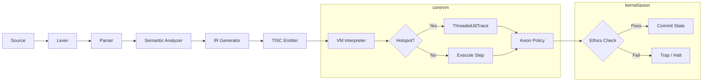
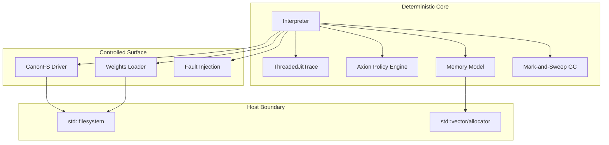
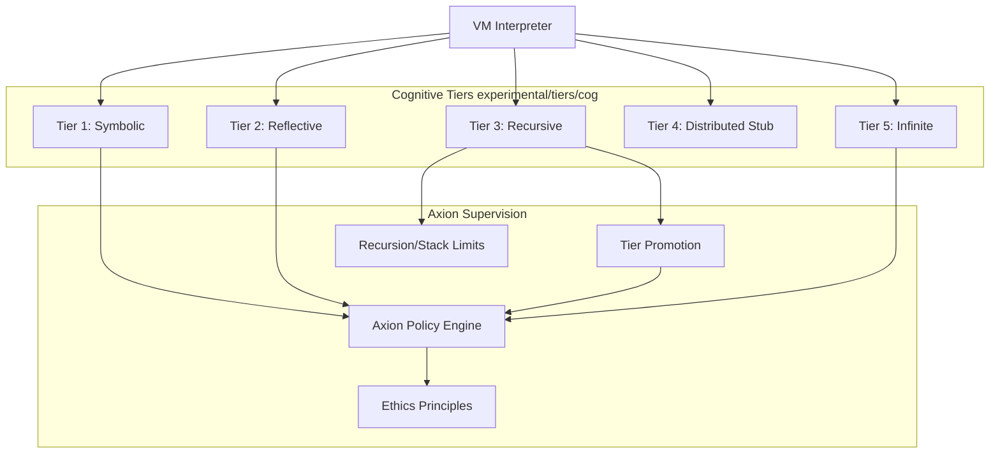
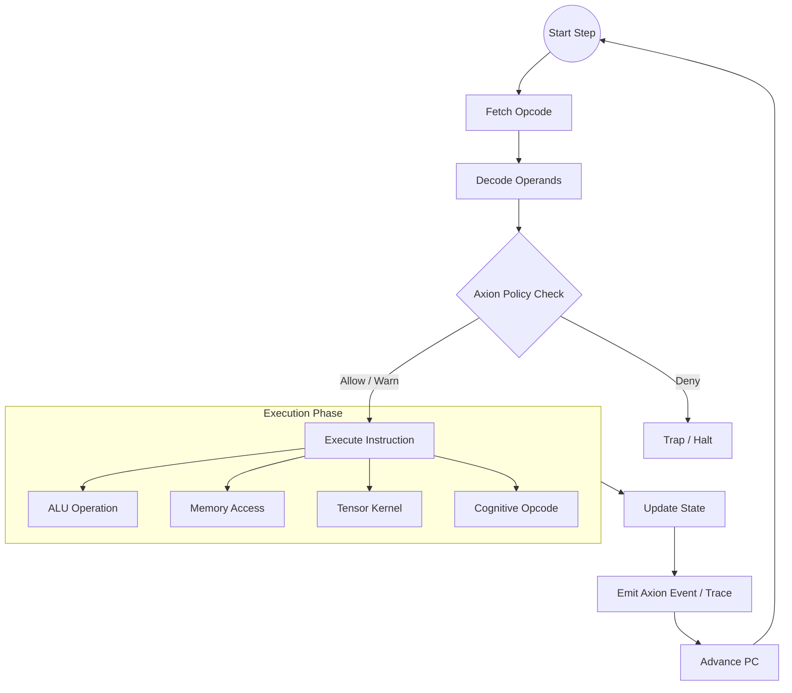

# T81 Canonical Architecture

<!-- T81-TOC:BEGIN -->

## Table of Contents

- [T81 Canonical Architecture](#t81-canonical-architecture)
  - [1. Execution Pipeline](#1-execution-pipeline)
  - [2. Runtime Boundary](#2-runtime-boundary)
  - [3. Cognitive Tier Escalation](#3-cognitive-tier-escalation)
  - [4. Data Types and Representation Map](#4-data-types-and-representation-map)
  - [5. TISC ISA → VM Execution Micro-Flow](#5-tisc-isa-→-vm-execution-micro-flow)
  - [6. CanonFS + Weights + Tensor Ingress](#6-canonfs-+-weights-+-tensor-ingress)

<!-- T81-TOC:END -->


This document defines the authoritative architecture of the T81 system as implemented in the current codebase.

## 1. Execution Pipeline

The execution pipeline transforms source code into TISC bytecode, which is then executed by the T81 VM under strict Axion policy supervision.



## 2. Runtime Boundary

The system strictly separates the deterministic core logic from the host-dependent surface and experimental features.



## 3. Cognitive Tier Escalation

The Cognitive Tier model defines the capabilities available to the runtime, escalating from basic symbolic manipulation to infinite series expansion, all supervised by Axion.



## 4. Data Types and Representation Map

The canonical numeric and symbolic types form a hierarchy where higher-level abstractions are built upon precise lower-level primitives, ensuring bit-exact determinism across the stack.

```mermaid
flowchart TD
    subgraph Primitives [Base Storage]
        Cell[T81Cell / T81Limb]
        Packed[Packed Trits (5 per Byte)]
    end

    subgraph Symbolic [Symbolic Algebra]
        BigInt[T81BigInt]
        Fraction[T81Fraction]

        Packed -- Decode --> BigInt
        Cell -- Construct --> BigInt
        BigInt -- "Num / Den" --> Fraction
        BigInt -- Canonicalize --> BigInt
        Fraction -- Canonicalize --> Fraction
    end

    subgraph Numeric [Numeric Computing]
        Float[T81Float + dmath]
        Native[Native Float (Optimization)]
        Tensor[Tensor (T729Tensor)]

        BigInt -- Mantissa --> Float
        Fraction -- Demote --> Float
        Float -- Element --> Tensor
        Native -- "Fast Path" --> Tensor
        Tensor -- "Matmul / Conv" --> Tensor
    end

    Tensor -- Serialize / Hash --> Packed
```

## 5. TISC ISA → VM Execution Micro-Flow

Each instruction execution step is strictly gated by the Axion Policy Engine, ensuring that every operation adheres to defined ethical and safety constraints before state mutation.



## 6. CanonFS + Weights + Tensor Ingress

The model ingestion pipeline ensures that large tensors are securely imported, hashed, and verified before being loaded into the VM's managed tensor pool.

```mermaid
flowchart LR
    subgraph Ingestion [Ingestion Tools]
        Raw[GGUF / SafeTensors]
        Quant[t81 weights quantize]
        T3K[T3_K / .t81w]

        Raw --> Quant
        Quant --> T3K
    end

    subgraph Storage [CanonFS Storage]
        T3K --> Import[t81 weights import]
        Import --> Canon[CanonFS Blocks]
        Canon --> Hash[Content Addressable Hash]
    end

    subgraph Runtime [VM Runtime]
        Hash --> Load[TLoadHash Opcode]
        Load --> Verify[Verify Hash & Integrity]
        Verify --> Native[NativeTensor]
        Native --> Promote[Promote to T729Tensor]
        Promote --> Pool[VM Tensor Pool]
        Pool --> Handle[Tensor Handle]
    end
```


