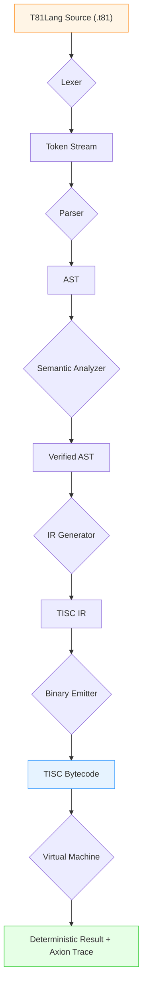
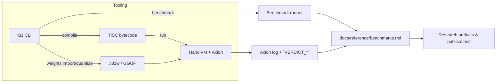

# AI Quickstart — T81 Foundation

This quickstart is the manifesto portal for automated agents: follow these steps to prove every session is reproducible, Axion-safe, and spec-aligned before publishing artifacts.

The goal is to give you the deterministic ledger keys (tools, specs, workflows) that map directly to the README portal.

______________________________________________________________________

# Ledger Entry 1. Files to Read First

Before making any edits, load and skim the following files:

1. `../../AGENTS.md`\
   – Canonical rules for agents, expectations, and constraints.

2. `../explanation/ARCHITECTURE.md`\
   – High-level overview of the T81 stack, layers, and directories.

3. `../../spec/index.md`\
   – Entrypoint into the formal specification documents.

4. `cpp-quickstart.md`\
   – Practical guide for building, running tests, and using the C++ API.

If the task relates to a specific subsystem:

- VM / execution: `../../spec/t81vm-spec.md`, `../../spec/tisc-spec.md`
- Language / compiler: `../../spec/t81lang-spec.md`
- Data types: `../../spec/t81-data-types.md`
- Axion / cognitive tiers: `../../spec/axion-kernel.md`, `../../spec/cognitive-tiers.md`

______________________________________________________________________

## 2. Environment and Tooling

T81 is a C++-first, spec-driven project with supporting Python and Node tooling.

### 2.1 Required tools

You will typically need:

- C++23-capable compiler (temporary C++20 compatibility lane via `-DT81_USE_CXX23=OFF`)
- CMake and Ninja (or another supported generator)
- Python 3.11+
- Node.js (for docs search index tooling)

In GitHub-hosted environments or devcontainers, these are usually preinstalled or configured via the repository’s CI setup.

______________________________________________________________________

## 3. Build and Test Commands

Unless otherwise specified, all commands are run from the repository root.

### 3.1 Configure and build

```bash
cmake -S . -B build -DCMAKE_BUILD_TYPE=Release
cmake --build build --parallel
```

You may use a different build type (e.g., `Debug`) when debugging:

```bash
cmake -S . -B build -DCMAKE_BUILD_TYPE=Debug
cmake --build build --parallel
```

### 3.2 Run the C++ test suite

```bash
ctest --test-dir build --output-on-failure
```

When adding or modifying core behavior, always run the tests and add new tests as needed under `tests/cpp/`.

______________________________________________________________________

## 4. Repository Map for Agents

Use this as a quick navigation reference:

- Core specs (normative):

  - `../../spec/` – formal specification for T81, VM, language, Axion, and cognitive tiers.
  - `../../spec/rfcs/` – proposals and accepted changes to the spec.

- Code:

  - `../../include/t81/` – public C++ API headers (primary interface).
  - `../../src/` – C++ implementations and C API bridge.
  - `../../tests/cpp/` – C++ tests.

- Docs and site:

  - `../` – documentation for users and contributors.
  - `../search/` – search index tooling.

- Legacy reference:

  - `../../legacy/hanoivm/` – historical CWEB implementation, used as reference for migration.

- AI guidance:

  - `../../AGENTS.md` – main agent instructions.
  - `../explanation/ARCHITECTURE.md` – architectural overview.
  - `../explanation/DESIGN.md` – design principles and invariants.
  - `../status/TASKS.md` – suggested tasks for humans and agents.
  - `../../CLAUDE.md`, `../../.github/copilot-instructions.md`, `../../.cursorrules` – tool-specific adapters.

______________________________________________________________________

## 5. Safe and High-Value Tasks for Agents

Good targets for automated assistance:

1. Tests

   - Add or improve unit tests in `tests/cpp/` for:

     - Big integer and fraction operations.
     - Tensor operations and shape/broadcast semantics.
     - VM instruction semantics where already specified.

2. Implementation cleanups

   - Refactor C++ code in `src/` to better match `include/t81/*.hpp`.
   - Remove duplication and clarify control flow without changing semantics.

3. Documentation

   - Clarify wording in `spec/*.md` and `docs/*.md` without altering defined behavior.
   - Add small, concrete examples that illustrate already-specified semantics.

4. Tooling and developer experience

   - Improve `cpp-quickstart.md`, `onboarding.md`, or similar guides.
   - Enhance search, indexing, or sidebar generation scripts in `../search/` and `../../scripts/`.

When in doubt, prefer tasks that improve clarity, test coverage, or maintainability over introducing new features.

______________________________________________________________________

## 6. Ground Rules for Automated Changes

These rules are intended for all agents and tools (Copilot, Claude, Cursor, etc.):

1. Spec-first

   - Treat files in `../../spec/` as the source of truth.
   - Do not introduce behavior that contradicts the spec.
   - If a change requires new semantics, it should be driven by a spec update or RFC.

2. Determinism

   - Do not add nondeterministic behavior (e.g., unbounded randomness, time-based logic) to core arithmetic, VM, or language execution paths.
   - Any necessary nondeterminism must be explicitly spec’d and, if applicable, gated by Axion.

3. Separation of concerns

   - Public API: `include/t81/`
   - Implementation: `src/`
   - Tests: `tests/cpp/`
   - Legacy reference: `legacy/` (do not extend legacy for new features).

4. Safety and Axion

   - Changes to Axion or cognitive tier semantics are sensitive.
   - Do not weaken safety or alignment constraints.
   - Always cross-check with `../../spec/axion-kernel.md` and `../../spec/cognitive-tiers.md`.

5. Scope of changes

   - Prefer focused, incremental edits over sweeping rewrites.
   - Avoid modifying many unrelated subsystems in a single change.

6. Documentation discipline

   - When changing behavior, update:

     - The relevant spec section in `../../spec/`.
     - The implementation in `../../include/t81/` and `../../src/`.
     - The tests in `../../tests/cpp/`.

   - Keep docs and code synchronized.

______________________________________________________________________

## 7. Suggested Workflow for Agents

A typical AI-assisted change should follow this loop:

1. Identify the target

   - Determine whether the task is about:

     - Specs, implementation, tests, or docs.

   - Find the relevant spec documents via `../../spec/index.md`.

2. Read before writing

   - Load `../../AGENTS.md`, `../explanation/ARCHITECTURE.md`, and the specific `../../spec/*.md` that governs the behavior.
   - For C++ changes, also read the relevant headers in `../../include/t81/`.

3. Plan

   - Describe the intended change in plain language:

     - Which files will be modified and why.
     - How it relates to existing spec sections.

4. Implement

   - Make minimal, clear changes in code and tests.
   - Respect existing style and abstractions.

5. Verify

   - Rebuild and run tests:

     - `cmake --build build --parallel`
     - `ctest --test-dir build --output-on-failure`

6. Summarize

   - Summarize what changed and which spec/sections are affected.
   - If appropriate, propose an RFC or spec amendment.

______________________________________________________________________

## 8. When to Ask for Human Review

Agents should request explicit human review or confirmation when:

- Modifying:

  - `spec/` semantics,
  - VM core behavior,
  - Instruction set definitions,
  - Axion or cognitive tiers.

- Introducing:

  - New public APIs in `include/t81/`,
  - New opcodes or language constructs,
  - Any new form of nondeterminism.

For routine refactors, documentation clarity, and additional tests, standard review is still expected but does not usually require architectural decisions.

______________________________________________________________________

By following this quickstart, agents can integrate into the T81 Foundation workflow in a predictable way, improving the system without undermining its specification, determinism, or safety guarantees.

______________________________________________________________________

## Visual Reference

These diagrams echo the same quick mental model offered in `docs/user-manual.md`.

### Toolchain & Execution Flow



### Workflow & Artifact Loop


