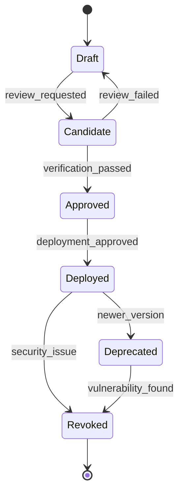

# RFC-00A3: Model Artifact Identity and Provenance (GGUF/Safetensors Policy)

Version 0.1 — Standards Track\
Status: Draft\
Author: T81 Foundation Architecture Team\
Applies to: Model Management, CanonFS Integration, Security Policies

______________________________________________________________________

## Summary

This RFC establishes a comprehensive policy for model artifact identity, provenance, and integrity within the T81 ecosystem. It defines standardized formats for model metadata, cryptographic verification procedures, and integration with the CanonFS content-addressed storage system to ensure complete audit trails for all AI models.

______________________________________________________________________

## Motivation

AI models represent critical security assets that can introduce vulnerabilities through:
- Undocumented modifications or backdoors
- Unclear training data provenance
- Inconsistent quantization artifacts
- Missing version control and lineage tracking

The T81 ecosystem requires a robust model provenance system that aligns with its deterministic and security principles while supporting common model formats like GGUF and Safetensors.

## Proposal

### Technical Details

#### 1. Model Artifact Classification

**Artifact Types:**
- **Source Models**: Original trained models (e.g., PyTorch, TensorFlow)
- **Canonical Models**: T81-optimized canonical format
- **Quantized Models**: Ternary quantized variants
- **Composite Models**: Multi-component model assemblies

**Trust Levels:**
- **Level 0 (Untrusted)**: External models without verification
- **Level 1 (Verified)**: Cryptographically verified artifacts
- **Level 2 (Audited)**: Manually reviewed and approved
- **Level 3 (Blessed)**: Official T81 foundation models

#### 2. Canonical Model Metadata

**Model Manifest Format:**
```json
{
  "model_manifest": {
    "identity": {
      "model_id": "t81:llama-7b-chat-v1.0",
      "artifact_hash": "sha3-256:abc123...",
      "canonical_hash": "sha3-256:def456...",
      "version": "1.0.0",
      "created": "2026-03-05T12:00:00Z"
    },
    "provenance": {
      "source": {
        "original_format": "pytorch",
        "source_url": "https://huggingface.co/meta-llama/Llama-2-7b-chat-hf",
        "source_hash": "sha256:...",
        "license": "Llama-2-License",
        "creator": "Meta AI"
      },
      "conversion": {
        "converter_version": "t81-convert-v1.2.1",
        "conversion_timestamp": "2026-03-05T12:30:00Z",
        "conversion_parameters": {
          "quantization": "t3_k",
          "precision": "ternary",
          "optimization_level": "O3"
        }
      }
    },
    "specifications": {
      "architecture": "llama",
      "parameters": 7040674816,
      "layers": 32,
      "hidden_size": 4096,
      "vocab_size": 32000,
      "context_length": 4096,
      "dtype": "t3_quantized"
    },
    "security": {
      "trust_level": 2,
      "signatures": [
        {
          "key_id": "t81-foundation-2024",
          "signature": "base64:...",
          "algorithm": "ed25519"
        }
      ],
      "audit_trail": [
        {
          "timestamp": "2026-03-05T12:00:00Z",
          "action": "model_created",
          "actor": "t81-build-system",
          "hash": "sha3-256:abc123..."
        }
      ]
    }
  }
}
```

#### 3. Format Compatibility Layer

**Supported Formats:**
```yaml
format_registry:
  gguf:
    mime_type: "application/gguf"
    magic_bytes: [0x47, 0x47, 0x55, 0x46]
    metadata_extraction: "gguf-reader"
    conversion_to_canonical: "gguf-to-t81"
    
  safetensors:
    mime_type: "application/safetensors"
    magic_bytes: [0x53, 0x41, 0x46, 0x45]
    metadata_extraction: "safetensors-reader"
    conversion_to_canonical: "safetensors-to-t81"
    
  t81_canonical:
    mime_type: "application/t81-model"
    magic_bytes: [0x54, 0x38, 0x31, 0x4D]
    native_support: true
    metadata_embedded: true
```

**Conversion Pipeline:**
```bash
# Convert external model to canonical format
t81 ai model convert \
  --input model.gguf \
  --output model.t81 \
  --format canonical \
  --quantization t3_k \
  --metadata model_manifest.json

# Verify model integrity
t81 ai model verify \
  --model model.t81 \
  --manifest model_manifest.json \
  --check-signatures

# Extract model metadata
t81 ai model inspect \
  --model model.t81 \
  --output metadata.json
```

#### 4. CanonFS Integration

**Storage Layout:**
```
CanonFS Store:
├── models/
│   ├── sha3-256:abc123.../           # Original model artifact
│   │   ├── model.t81                  # Canonical model file
│   │   ├── manifest.json              # Model metadata
│   │   ├── conversion.log             # Conversion details
│   │   └── verification.json          # Verification results
│   ├── sha3-256:def456.../           # Quantized variant
│   └── sha3-256:ghi789.../           # Fine-tuned version
└── registries/
    ├── trusted_models.json           # Approved model registry
    └── revoked_models.json           # Compromised model list
```

**Access Control:**
```json
{
  "model_access_policy": {
    "allowed_sources": [
      "t81-foundation-registry",
      "huggingface-verified",
      "internal-organization"
    ],
    "blocked_hashes": [
      "sha3-256:compromised_model_hash"
    ],
    "required_signatures": [
      "t81-foundation-2024",
      "trusted-third-party"
    ],
    "size_limits": {
      "max_parameters": 100000000000,
      "max_file_size": "100GB"
    }
  }
}
```

#### 5. Model Lifecycle Management

**Lifecycle States:**
- **Draft**: Model under development
- **Candidate**: Ready for review
- **Approved**: Verified and approved
- **Deployed**: Active in production
- **Deprecated**: Superseded by newer version
- **Revoked**: Security or quality issues

**State Transitions:**


#### 6. Security and Verification

**Cryptographic Verification:**
```bash
# Verify model signature
t81 ai model verify-signature \
  --model model.t81 \
  --signature signature.sig \
  --public-key trusted_key.pub

# Check against revoked list
t81 ai model check-revoked \
  --model-hash sha3-256:abc123...

# Verify conversion integrity
t81 ai model verify-conversion \
  --source model.gguf \
  --target model.t81 \
  --expected-hash sha3-256:def456...
```

**Audit Trail Requirements:**
- All model access logged with timestamps
- Conversion steps fully documented
- Signature verification results recorded
- Policy decisions and justifications stored

### Corner Cases

#### Model Format Evolution
- Backward compatibility for older formats
- Migration path for deprecated formats
- Version-specific handling procedures

#### Partial Model Corruption
- Detect and report corrupted model segments
- Attempt recovery from redundant sources
- Fallback to previous known-good version

#### Cross-Platform Model Differences
- Platform-specific model variants
- Endianness handling for model weights
- Floating-point format compatibility

## Impact

### Backward Compatibility

Existing model loading code continues to work. New verification features are opt-in.

### Performance

Model verification adds overhead:
- Signature verification: ~10-50ms per model
- Hash computation: ~100-500ms for large models
- Metadata extraction: ~5-20ms

Overhead is one-time during model loading.

### Security

Significantly enhanced security through:
- Cryptographic verification of model integrity
- Comprehensive audit trails
- Revocation capability for compromised models
- Policy-based access control

## Alternatives Considered

1. **Format-specific handling**: Rejected due to complexity
2. **Metadata-only verification**: Rejected due to insufficient security
3. **Centralized model registry**: Rejected due to single point of failure

## UX / Developer Experience Impact

### CLI Interface

```bash
# List available models
t81 ai model list --source trusted --format table

# Download and verify model
t81 ai model pull llama-7b-chat --verify-signatures

# Convert model to T81 format
t81 ai model convert model.gguf --quantize t3_k

# Inspect model details
t81 ai model inspect model.t81 --show-provenance

# Verify model integrity
t81 ai model verify model.t81 --strict

# Check model security status
t81 ai model security-check model.t81
```

### IDE Integration

- Model browser with provenance information
- Automatic verification during model loading
- Security status indicators
- Conversion wizard with optimization suggestions

### Development Workflow

- Automatic model verification in CI/CD
- Model dependency management
- Security scan integration
- Performance impact assessment

## Acceptance Criteria

1. Model manifest format supports all required metadata
2. Conversion pipeline works with GGUF and Safetensors
3. CanonFS integration provides secure storage
4. Verification procedures detect tampering
5. Audit trail captures all model operations

## Promotion Gates

### Experimental → Extension
- [ ] Support for GGUF and Safetensors implemented
- [ ] Conversion pipeline produces deterministic results
- [ ] Security verification working across platforms
- [ ] Integration with CanonFS complete

### Extension → Core
- [ ] Adopted as standard model handling in T81
- [ ] All official models use canonical format
- [ ] Community adoption for model distribution
- [ ] Security audit passed by third parties

## Impact

### Backward Compatibility

Existing model loading code continues to work. New verification features are opt-in.

### Performance

Model verification adds overhead:
- Signature verification: ~10-50ms per model
- Hash computation: ~100-500ms for large models
- Metadata extraction: ~5-20ms

Overhead is one-time during model loading.

### Security

Significantly enhanced security through:
- Cryptographic verification of model integrity
- Comprehensive audit trails
- Revocation capability for compromised models
- Policy-based access control

______________________________________________________________________

## Alternatives Considered

1. **Format-specific handling**: Rejected due to complexity
2. **Metadata-only verification**: Rejected due to insufficient security
3. **Centralized model registry**: Rejected due to single point of failure

______________________________________________________________________

## References

- [CanonFS Specification](../supplemental/canonfs-spec.md)
- [Policy-Gated Tensor Loading](RFC-0025-policy-gated-tensor-loading.md)
- [Axion Safety Model](RFC-0003-axion-safety-model.md)
- [GGUF Specification](https://github.com/ggerganov/ggml/blob/master/docs/gguf.md)
- [Safetensors Specification](https://huggingface.co/docs/safetensors/index)
